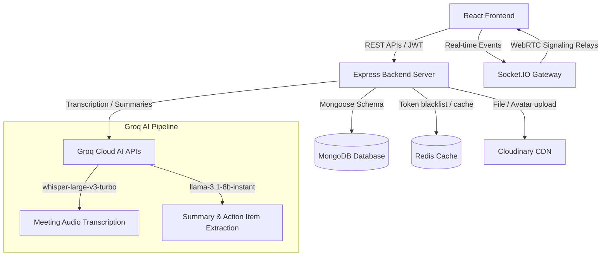

 IntellMeet — Presentation & Viva Study Guide

This document is designed to help you prepare for presentations, demos, and technical interviews (viva) for **IntellMeet**—an AI-powered enterprise meeting and collaboration platform.

---

## 1. Project Overview & Core Value Proposition

### What is IntellMeet?
IntellMeet is a **production-grade, full-stack enterprise collaboration platform** that unifies real-time video conferencing, interactive chat, presence tracking, and team workspaces with automated post-meeting intelligence.

### The Problem It Solves
1. **Lost Information**: Key details, agreements, and context in meetings are often forgotten or mistranscribed.
2. **Scattered Workflows**: Teams must manually copy notes from call logs into task managers (like Jira or Trello).
3. **Inefficient Collaboration**: Video conferencing, chat, and task tracking are usually separated across multiple applications.

### The Solution (Core Value)
IntellMeet provides a **single workspace** where:
- Users meet via high-quality video/audio with real-time screen sharing.
- The platform automatically records, transcribes, and uses AI (via Groq LLMs) to summarize discussions and extract action items.
- Extracted action items are converted directly into Kanban board tasks for instant team assignments.

---

## 2. Platform Architecture & Data Flow



### Key Architectural Concepts
1. **Decoupled Architecture**: High-speed, separate Frontend (Vite/React) and Backend (Node.js/Express) services.
2. **Real-time Gateway**: Socket.IO handles live state synchronization (who is in the room, typing indicators, hands raised, media status toggles).
3. **WebRTC Peer-to-Peer**: Video/audio data is streamed directly between client browsers. The server only acts as a signaling channel (relaying WebRTC offers, answers, and ICE candidates) to minimize server bandwidth costs.
4. **Asynchronous Post-Meeting Pipeline**: When a meeting ends, the audio recording and transcript are processed. Prompts are run against Groq LLMs to extract structural JSON summaries and action items, which are persisted to MongoDB.

---

## 3. The Tech Stack Breakdown

### Frontend (Client-side)
*   **Framework**: **React 19** & **TypeScript** (compiled via **Vite** for rapid bundling).
*   **Styling**: **Tailwind CSS v3** combined with **shadcn/ui** (radix-ui primitives) for professional, fully responsive dark-mode layouts.
*   **State Management**:
    *   **Zustand**: Lightweight global store for authentication state, active socket connections, and notification states.
    *   **TanStack Query (React Query)**: For caching server data, fetching list views, and optimistic UI updates.
*   **Analytics & Visuals**: **Recharts** for rendering visual insights (talk time distribution, sentiment graphs, and engagement scores).
*   **Real-time Media**: HTML5 MediaStream API and Web Speech API.

### Backend (Server-side)
*   **Runtime Environment**: **Node.js** with **Express.js** (written using ES modules).
*   **Real-time Server**: **Socket.IO** handling bi-directional WebSocket connections.
*   **Primary Database**: **MongoDB** using **Mongoose ODM** (Object Document Mapper) for schemas (Users, Teams, Meetings, Tasks, ChatMessages, Transcripts).
*   **Caching & Session Storage**: **Redis** (used for caching meetings and blacklisting revoked JWT tokens).
*   **Media Hosting**: **Cloudinary** for storing uploaded user avatars and post-meeting audio attachments.

### AI & Integrations
*   **Groq Cloud API**: Uses hardware-accelerated AI models:
    *   `whisper-large-v3-turbo` for near-instant audio-to-text transcription.
    *   `llama-3.1-8b-instant` for summarizing text transcripts and generating structured JSON arrays of action items.

---

## 4. Deep Dive into Core Features

### A. WebRTC Video Calling & Signaling
1. **Media Stream Capture**: The frontend accesses the user's camera/microphone via `navigator.mediaDevices.getUserMedia()`.
2. **Signaling**: WebRTC requires peers to exchange network information (ICE candidates) and session descriptions (SDP offers/answers). Sockets handle this routing:
    *   *Client A* sends `offer` → *Socket.IO* → *Client B*
    *   *Client B* responds with `answer` → *Socket.IO* → *Client A*
3. **Peer Connection**: Once signaling is complete, browsers establish a direct Peer Connection (`RTCPeerConnection`) and stream media without passing data through the Node.js server.

### B. The AI Post-Meeting Pipeline
1. **Audio Capture**: During the live call, client-side scripts capture audio tracks.
2. **Meeting End**: When the host clicks **End Meeting**, the recording stops and gets compiled into an audio blob (WebM/MP3).
3. **Pipeline Request**: The blob and live transcript segments are sent via `POST /api/ai/meetings/:meetingId/process` to the backend.
4. **AI Pipeline Execution**:
    ```
    Audio Blob ➔ Groq Whisper (Speech-to-Text) ➔ Llama 3.1 Summarization ➔ Llama 3.1 JSON Action Item Extractor ➔ Save to DB ➔ Cache Invalidation ➔ Notify Participants
    ```
5. **Resilient Fallbacks**: If the AI API fails (e.g., rate limits or network issues), a contextual fallback transcript and summary generator ensure the application does not crash.

### C. Kanban Task Board & Team Workspaces
*   Action items extracted by the AI are linked to the meeting.
*   The host can convert these items into official **Tasks** inside the Team Workspace.
*   A fully interactive Kanban board permits team members to drag and drop tasks across columns (`Todo` ➔ `In Progress` ➔ `Done`), updating status in real-time.

### D. Advanced Security & Authentication
*   **Dual-Token System**:
    *   **Access Token**: Short-lived (e.g., 15m), stored in memory, sent via the `Authorization: Bearer <token>` header.
    *   **Refresh Token**: Long-lived, stored in a secure, **HTTP-only cookie** (immune to XSS attacks).
*   **Token Rotation & Blacklisting**: On logout or token rotation, the old token's unique identifier (`jti`) is blacklisted in **Redis** until its expiration, preventing replay attacks.

---

## 5. End-to-End Workflow Walkthrough

### Scenario: Scheduling and Hosting a Meeting

```
[User Dashboard]
   │
   ├── 1. Click "New Meeting" ➔ Generates unique ID (e.g., abc-123) and schedules time
   │
[Live Meeting Room]
   │
   ├── 2. Host Joins Room ➔ Initializes WebRTC PeerConnection & Socket.IO listener
   ├── 3. Participants Join ➔ Presence update broadcasted to all users
   ├── 4. Collaborative Chat ➔ Socket.IO relays text & stores logs in MongoDB
   ├── 5. Live Speech-to-Text ➔ Web Speech API transcribes live audio in background
   ├── 6. Host Ends Call ➔ Broadcast "meeting-ended" event, stopping recordings
   │
[AI Post-Processing]
   │
   ├── 7. Frontend uploads Audio Blob to '/process' endpoint
   ├── 8. Whisper transcribes audio ➔ Llama generates summary & extracts action items
   ├── 9. Results saved to MongoDB ➔ Cache invalidated in Redis ➔ Sockets send push notification
   │
[Post-Meeting Dashboard & Kanban]
   │
  10. Participants view summaries, sentiment scores, and download transcript
  11. Host reviews action items & inserts them into the team Kanban board
```

---

## 6. Frequently Asked Presentation / Viva Questions

#### Q1: Why did you use WebRTC instead of routing video through the server?
**Answer**: WebRTC enables peer-to-peer (P2P) connections. Since video/audio streams directly between users, it minimizes server bandwidth consumption, decreases latency, and scales cost-effectively. Routing video through a server requires expensive media servers (like SFUs/MCUs).

#### Q2: What is the role of Socket.IO if WebRTC is peer-to-peer?
**Answer**: WebRTC cannot establish a connection out-of-the-box because peers don't know each other's IP addresses, open ports, or connection protocols. Socket.IO acts as the **Signaling Server**. It relays the initial configuration payloads (SDP offers, answers, and ICE candidates) so the peers can locate and connect to each other.

#### Q3: How do you secure user authentication and session states?
**Answer**: We implement a JWT-based Auth model. Access tokens are short-lived and stored in memory. Refresh tokens are stored in secure, `httpOnly`, `sameSite: strict` cookies, shielding them from client-side JavaScript access (preventing XSS-based theft). Old tokens are blacklisted in Redis to prevent reuse.

#### Q4: Why did you introduce Redis into the system?
**Answer**: Redis serves two critical purposes:
1. **High-Performance Caching**: Frequently requested meeting metadata or database documents are cached to bypass heavy MongoDB lookup operations.
2. **Distributed Blacklisting**: Expired/revoked access token IDs (`jti`) are stored in Redis with an auto-expiring TTL (Time-To-Live), ensuring fast, stateless validation on request middleware.

#### Q5: What happens if the Groq API key is invalid or the network times out?
**Answer**: The backend implements defensive try-catch statements and **resilient fallbacks**. If Groq Whisper or Llama fails, the system triggers local algorithmic generators that generate summaries and extract key phrases from the client's transcribed text so the user's meeting session can still close successfully.

#### Q6: How do you handle large file uploads like meeting recordings?
**Answer**: We limit uploads (e.g. max 25MB) and stream files directly to **Cloudinary** using multipart form-data. Cloudinary hosts the static media, providing optimized Content Delivery Network (CDN) links which we save back into our MongoDB documents.
